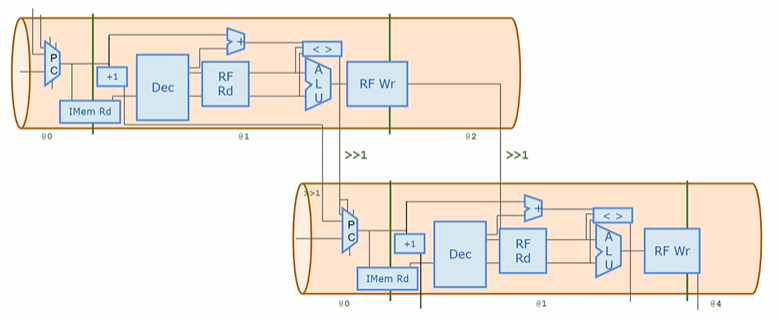
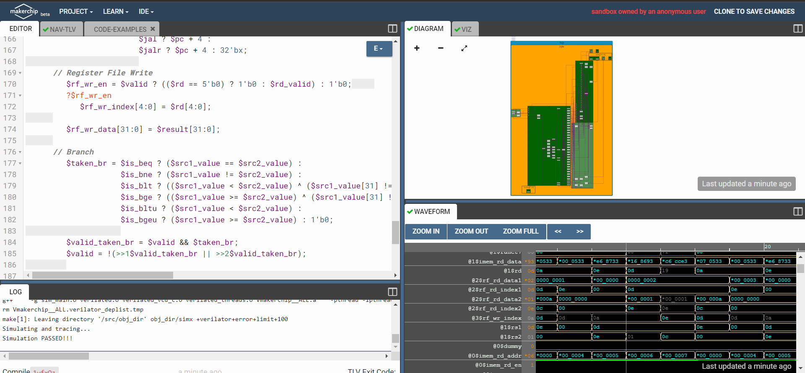
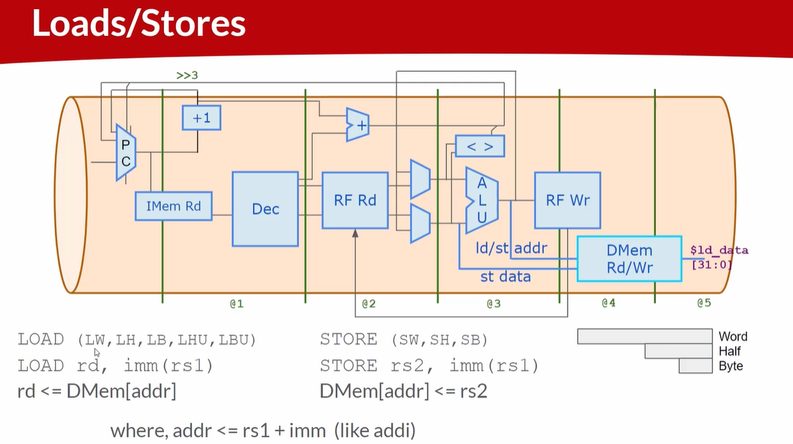
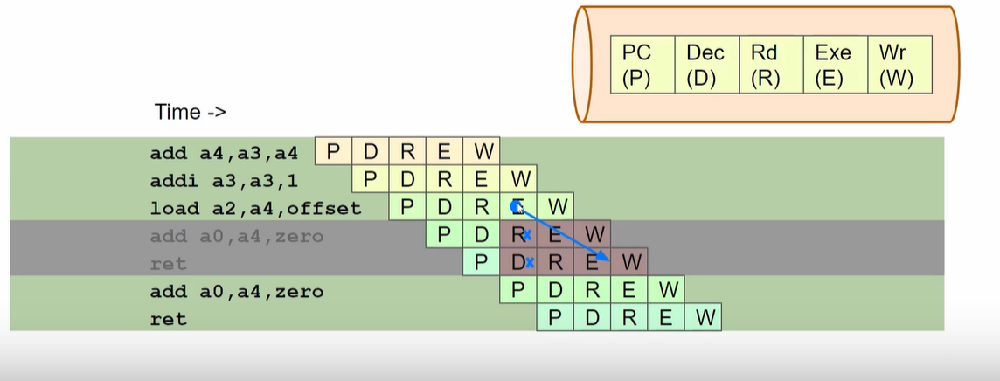
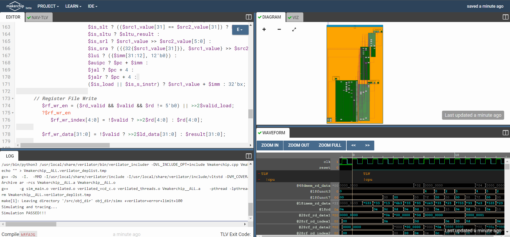
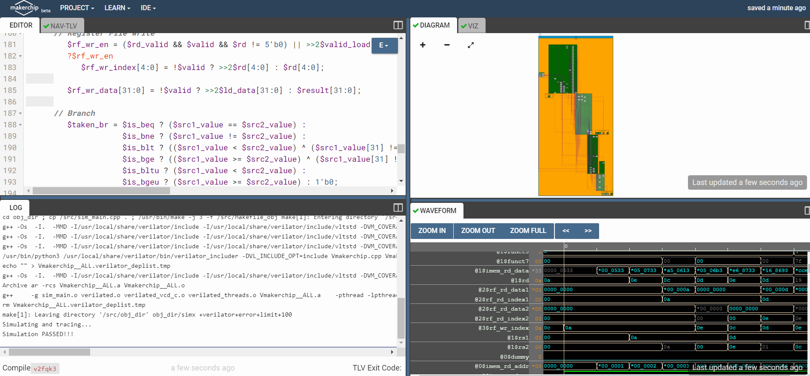
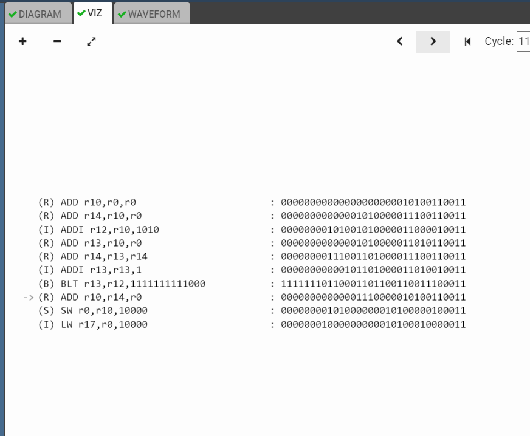

# RISC-V

<details>
<summary>Installation steps</summary>
Below are the steps and commands to install risc-v toolchain

```bash
git clone https://github.com/kunalg123/riscv_workshop_collaterals.git
cd riscv_workshop_collaterals
chmod 755 run.sh
./run.sh
```
Once the cloning is done and if there is not any error then set the PATH variable in 
.bashrc file using below commands

```
gedit .bashrc
export PATH="/home/user/riscv_toolchain/riscv64-unknown-elf-gcc-8.3.0-2019.08.0-x86_64-linux-ubuntu14/bin:$PATH" #Instead of user replace it with your user name
#save and close the bashrc
source .bashrc
```
Now try the "riscv64-unknown-elf-gcc" command and if there is any error shows below 
is how to debug: If you are getting the error about "iverilog" then use below commands

```
sudo apt-get install libboost-regex-dev
git clone https://github.com/steveicarus/iverilog.git
cd iverilog/
git checkout --track -b v10-branch origin/v10-branch
git pull 
chmod 777 autoconf.sh 
./autoconf.sh 
./configure 
make
sudo make install 
```

If you are getting the error about "riscv-pk" then use below commands

```
sudo apt-get install libboost-regex-dev
git clone https://github.com/riscv/riscv-pk.git
cd riscv-pk/
mkdir build
cd build/
../configure --prefix=$pwd/riscv_toolchain/riscv64-unknown-elf-gcc-8.3.0-2019.08.0-x86_64-linux-ubuntu14 --host=riscv64-unknown-elf
make
sudo make install
```

If there is error showing that "Spike-command is not found" when running the spike, Try running run.sh again , it will be resolved.  

Don't forget to add PATH in .bashrc and source the .bashrc file  
  
Acknowledgement : Bhargav D V , Alwin Shaju, Emil Jayanth Lal, Kanish R, Divyam Satle : Colleauges(IIIT-B)
</details>

## Day 1

<details>
<summary>Overview  
</summary>RISC-V is an open-source instruction set architecture (ISA) used for the development of custom processors targeting a variety of end applications. The flow
of this architecture from application software or apps to the hardware and there is
system software block which consists of os, compiler and assembler and the flow is as follows: Os which handle IO operations, allocate memory and low level synthesis functions.
Compiler converts c,c++, java to instructions and then assembler converts this instructions
into the binary data which hardware can understand. Below shown the diagram


</details>

<details><summary>
Integer number representation
</summary>
The 64-bit number system for unsigned numbers is a fundamental concept in computer science and digital systems. It is an integral part of modern computing architectures and plays a crucial role in representing and manipulating numerical data. This number system is based on the binary (base-2) numeral system, which uses only two symbols, typically 0 and 1, to represent all numbers. In the context of a 64-bit number system, each number is composed of 64 binary digits, commonly referred to as "bits."
The number of bits determines the range of values that can be represented. For a 64-bit system(RISC-V doubleword), the range of possible values for an unsigned number is from 0 to 2^64 - 1.


64-bit signed number system: The 64-bit signed number system is another crucial aspect of computer science and digital systems. It's an extension of the 64-bit unsigned number system that allows the representation of both positive and negative integers using binary digits. In this system, the leftmost bit (most significant bit) is used as the sign bit, determining whether the number is positive or negative. The remaining 63 bits represent the magnitude of the number.


</details>

<details><summary>RISCV gcc compilation and assembly </summary>
Below is the command to compile the c code through riscv compiler

```
riscv64-unknown-elf-gcc -O1 -mabi=lp64 -march=rv64i -o 1ton.o 1ton.c
```


Below command is to observe the result

```
riscv64-unknown-elf-objdump -d 1ton.o
```
Get the output file using spike  
Below is the command to get the object output
```
spike pk 1ton.o
```


To debug the output 

```
spike -d pk 1ton.o
```

Now to observe the file and memory locations use following commands  

```
until pc 0 100b0
reg 0 a1
```


Below is the architecture


</details>

## Day 2

<details><summary>Application Binary Interface
</summary>
Application binary interface (ABI) is an interface between two binary program modules. Often, one of these modules is a library or operating system facility, and the other is a program that is being run by a user.  
  
An ABI defines how data structures or computational routines are accessed in machine code, which is a low-level, hardware-dependent format. In contrast, an application programming interface (API) defines this access in source code, which is a relatively high-level, hardware-independent, often human-readable format. A common aspect of an ABI is the calling convention, which determines how data is provided as input to, or read as output from, computational routines.  

Here below shown the diagram


Memory allocation for double words typically involves reserving contiguous blocks of memory in a computer's RAM (Random Access Memory) to store data that is twice the size of a standard word, which is often 32 bits or 4 bytes on many computer architectures. Double words are typically 64 bits or 8 bytes in size. This allocation process is fundamental in computer programming, as it allows for the efficient storage and manipulation of larger data structures and numeric values, such as long integers or floating-point numbers with higher precision. When allocating memory for double words, it's essential to ensure proper alignment, so the memory addresses are consistent with the system's architecture, as misaligned memory access can result in performance penalties or even program crashes.  


Load and store single register instructions can transfer a 32-bit word, a 16-bit halfword, or an 8-bit byte between memory and a register. Byte and halfword loads can be automatically zero extended or sign extended as they are loaded.

Load and store instructions have three primary addressing modes:
  
offset
  
pre-indexed
  
post-indexed.
  
The address is formed by adding or subtracting an immediate or register- based offset to or from a base register. Register-based offsets can also be scaled with shift operations. Pre-indexed and post-indexed addressing modes update the base register with the result of the offset calculation.

Below shown the representation 


</details>
<details>
  <summary>ABI function cells</summary>

Below is the custom file: 


Below is the objdump:


Below is using spike command: 


Below is another method command:


Below is the conclusion: 


</details>

## Day 3 (Digital Logic with TL-Verilog and Makerchip)

<details><summary>Combinational logic in TL-Verilog using Makerchip</summary>
Below shown logic gates representation and their truth tables


Consider below full adder circuit which shows interconnection of logic gates to get the output S(sum) and Cout


Below shown representation of boolean operators:  


To write code of mux in verilog 

```
assign f = s ? x1 : x2;
```

**Makerchip IDE**  
Go to the makerchip.com there are several examples below shown some of the examples  (**Combinational logic**)
Below shown multiplexer  


Below shown FPGA multiplier:  


Below shown ripple carry :  


Below is adder:  


</details>

<details><summary>Sequential circuits</summary>
 Sequential circuits are digital circuits that store and use the previous state information to determine their next state.  

    
 Sequential circuits are commonly used in digital systems to implement state machines, timers, counters, and memory elements. The memory elements in sequential circuits can be implemented using flip-flops, which are circuits that store binary values and maintain their state even when the inputs change.  

  

Below shown makerchip of fibonacci series:  


Below is the representation of counter: 


Below is sequential calculator:  


</details>

<details><summary>Pipelined Logic</summary>

Below shown pipeline logic:  


Below is pythagorans thm makerchip implementation:  


Here below shown errorpipe implementation :  


Here is difference between TL-verilog and system verilog representation whish shows code reduction:  


Here below shown diagram Fibonacci in a pipeline :  


Below is makerchip implementation:  


Below is Counter and Calculator in pipeline:  


Below shown cyclic calculator diagram:  


Below is makerchip implementation of counter calculator:  


Below is makerchip implementation of two cycle calculator: 


</details>

<details><summary>Validity</summary>


Below shown diagram of total distance calculator: 


Below is makerchip implementation of total_dist calculator:  


Below shown makerchip implementaion of pythagorans thm validity:  


Below shown the structure of the two cycle calculator with validity:  


And below is its makerchip implementation:  


Below shown the structure of the calculator with single value memory :  


And below is it's makerchip implementation:  


Below is makerchip implementation of Conway's Game of Life :  


</details>

## Day 4 (Basic RISC-V CPU micro-architecture)

<details><summary>Introduction</summary>
  
The term architecture describes the functional specification of a processor. It describes what functionality the software can rely on the hardware to provide. Architecture does not tell you how a processor is built. It tells you what a processor can do. Micro-architecture on the other hand describes how a processor is built and designed. Micro-architecture defines, the number and size of caches, cycle counts of instructions, pipeline length, and more.

  Below shown micro-architecture: 
  
  

  

Below is makerchip implementation:  


</details>
<details><summary>Instruction Fetch and Decode</summary>

Below is startpoint: 


Below is makerchip implementation of Instruction fetch:


Below is instruction fetch logic2: 


Below shown diagram of instruction Decode where ALU RF read and RF write is there: 


Below showed complet circled instructions: 


Here is instr[6:2] determine instruction type which are I, R, S, B, J, U: 


Below is makerchip implementation:


Below shown immediate decode logic makerchip implementation: 


Decode other fields of instructions :   
Here below shown I, S, B , U, J-immediate instruction in below diagram:
  


</details>

<details><summary>Control logic</summary>
Here below shown register file read diagram:
  


Below shown makerchip implementation:  


Here is register read file2 : 


Below its makerchip implementation:  


Below shown ALU diagram for operation add/addi:  


And below is its makerchip implementation:  


Here is reg file write diagram:  


Below is its makerchip implementation:  


Now lets start with Branch instruction and to understand see below diagrams:  


Below is its makerchip implementation:  


Makerchip implementation:  


Now lets see about testbench:  

```
*passed = |cpu/xreg[10]>>5$value == (1+2+3+4+5+6+7+8+9);
```


Below is its makerchip implementation:  


</details>

## Day 5 (Complete Pipelined RISCV CPU micro-arch)

<details><summary>Pipelining the CPU </summary>

To understand the pipeline look below the waterfall logic diagram



Where there are multiple stages in pipeline mode ex. stage-0, stage-1..  

Having 3 cycles delay rest all are pipelined.  
Here below is the code shown:  

```
\m4_TLV_version 1d: tl-x.org
\SV
   // This code can be found in: https://github.com/stevehoover/RISC-V_MYTH_Workshop
   
   m4_include_lib(['https://raw.githubusercontent.com/BalaDhinesh/RISC-V_MYTH_Workshop/master/tlv_lib/risc-v_shell_lib.tlv'])

\SV
   m4_makerchip_module   // (Expanded in Nav-TLV pane.)
\TLV
 m4_asm(ADD, r10, r0, r0)             // Initialize r10 (a0) to 0.
   // Function:
   m4_asm(ADD, r14, r10, r0)            // Initialize sum register a4 with 0x0
   m4_asm(ADDI, r12, r10, 1010)         // Store count of 10 in register a2.
   m4_asm(ADD, r13, r10, r0)            // Initialize intermediate sum register a3 with 0
   // Loop:
   m4_asm(ADD, r14, r13, r14)           // Incremental addition
   m4_asm(ADDI, r13, r13, 1)            // Increment intermediate register by 1
   m4_asm(BLT, r13, r12, 1111111111000) // If a3 is less than a2, branch to label named <loop>
   m4_asm(ADD, r10, r14, r0)            // Store final result to register a0 so that it can be read by main program
   
   // Optional:
   // m4_asm(JAL, r7, 00000000000000000000) // Done. Jump to itself (infinite loop). (Up to 20-bit signed immediate plus implicit 0 bit (unlike JALR) provides byte address; last immediate bit should also be 0)
   m4_define_hier(['M4_IMEM'], M4_NUM_INSTRS)

   |cpu
      @0
         $reset = *reset;
      
      //Fetch
         // Next PC
         $pc[31:0] = (>>1$reset) ? '0 : 
                     (>>3$taken_br) ? >>3$br_tgt_pc : >>1$inc_pc;
         
         $imem_rd_en = !$reset;
         $imem_rd_addr[31:0] = $pc[M4_IMEM_INDEX_CNT+1:2];
         
      @1         
         $instr[31:0] = $imem_rd_data[31:0];
         $inc_pc[31:0] = $pc + 32'd4;  
      // Decode   
         $is_i_instr = $instr[6:2] ==? 5'b0000x ||
                       $instr[6:2] ==? 5'b001x0 ||
                       $instr[6:2] == 5'b11001;
         $is_r_instr = $instr[6:2] ==? 5'b01011 ||
                       $instr[6:2] ==? 5'b10100 ||
                       $instr[6:2] ==? 5'b0110x;                       
         $is_b_instr = $instr[6:2] == 5'b11000;
         $is_u_instr = $instr[6:2] == 5'b0x101;
         $is_s_instr = $instr[6:2] == 5'b0100x;
         $is_j_instr = $instr[6:2] == 5'b11011;
         
         $imm[31:0] = $is_i_instr ? { {21{$instr[31]}} , $instr[30:20] } :
                      $is_s_instr ? { {21{$instr[31]}} , $instr[30:25] , $instr[11:8] , $instr[7] } :
                      $is_b_instr ? { {20{$instr[31]}} , $instr[7] , $instr[30:25] , $instr[11:8] , 1'b0} :
                      $is_u_instr ? { $instr[31:12] , 12'b0} : 
                      $is_j_instr ? { {12{$instr[31]}} , $instr[19:12] , $instr[20] , $instr[30:21] , 1'b0} : 32'b0;
         
         $rs2_valid = $is_r_instr || $is_s_instr || $is_b_instr;
         $rs1_valid = $is_r_instr || $is_s_instr || $is_b_instr || $is_i_instr;
         $rd_valid = $is_r_instr || $is_i_instr || $is_u_instr || $is_j_instr;
         $funct3_valid = $is_r_instr || $is_s_instr || $is_b_instr || $is_i_instr;
         $funct7_valid = $is_r_instr;
         
         ?$rs2_valid
            $rs2[4:0] = $instr[24:20];
         ?$rs1_valid
            $rs1[4:0] = $instr[19:15];
         ?$rd_valid
            $rd[4:0] = $instr[11:7];
         ?$funct3_valid
            $funct3[2:0] = $instr[14:12];
         ?$funct7_valid
            $funct7[6:0] = $instr[31:25];
            
         $opcode[6:0] = $instr[6:0];
         
         $dec_bits[10:0] = {$funct7[5],$funct3,$opcode};
         
         // Branch Instruction
         $is_beq = $dec_bits ==? 11'bx_000_1100011;
         $is_bne = $dec_bits ==? 11'bx_001_1100011;
         $is_blt = $dec_bits ==? 11'bx_100_1100011;
         $is_bge = $dec_bits ==? 11'bx_101_1100011;
         $is_bltu = $dec_bits ==? 11'bx_110_1100011;
         $is_bgeu = $dec_bits ==? 11'bx_111_1100011;
         
         // Arithmetic Instruction
         $is_add = $dec_bits ==? 11'b0_000_0110011;
         $is_addi = $dec_bits ==? 11'bx_000_0010011;
         $is_or = $dec_bits ==? 11'b0_110_0110011;
         $is_ori = $dec_bits ==? 11'bx_110_0010011;
         $is_xor = $dec_bits ==? 11'b0_100_0110011;
         $is_xori = $dec_bits ==? 11'bx_100_0010011;
         $is_and = $dec_bits ==? 11'b0_111_0110011;
         $is_andi = $dec_bits ==? 11'bx_111_0010011;
         $is_sub = $dec_bits ==? 11'b1_000_0110011;
         $is_slti = $dec_bits ==? 11'bx_010_0010011;
         $is_sltiu = $dec_bits ==? 11'bx_011_0010011;
         $is_slli = $dec_bits ==? 11'b0_001_0010011;
         $is_srli = $dec_bits ==? 11'b0_101_0010011;
         $is_srai = $dec_bits ==? 11'b1_101_0010011;
         $is_sll = $dec_bits ==? 11'b0_001_0110011;
         $is_slt = $dec_bits ==? 11'b0_010_0110011;
         $is_sltu = $dec_bits ==? 11'b0_011_0110011;
         $is_srl = $dec_bits ==? 11'b0_101_0110011;
         $is_sra = $dec_bits ==? 11'b1_101_0110011;
         
         // Load Instruction
         $is_load = $dec_bits ==? 11'bx_xxx_0000011;
         
         // Store Instruction
         $is_sb = $dec_bits ==? 11'bx_000_0100011;
         $is_sh = $dec_bits ==? 11'bx_001_0100011;
         $is_sw = $dec_bits ==? 11'bx_010_0100011;
         
         // Jump Instruction
         $lui = $dec_bits ==? 11'bx_xxx_0110111;
         $auipc = $dec_bits ==? 11'bx_xxx_0010111;
         $jal = $dec_bits ==? 11'bx_xxx_1101111;
         $jalr = $dec_bits ==? 11'bx_000_1100111;
         
      @2   
      // Register File Read
         $rf_rd_en1 = $rs1_valid;
         ?$rf_rd_en1
            $rf_rd_index1[4:0] = $rs1[4:0];
         
         $rf_rd_en2 = $rs2_valid;
         ?$rf_rd_en2
            $rf_rd_index2[4:0] = $rs2[4:0];
            
      // Branch Target PC       
         $br_tgt_pc[31:0] = $pc + $imm;
      
      // Input signals to ALU
         $src1_value[31:0] = ((>>1$rd == $rs1) && >>1$rf_wr_en) ? >>1$result : $rf_rd_data1[31:0];
         $src2_value[31:0] = ((>>1$rd == $rs2) && >>1$rf_wr_en) ? >>1$result : $rf_rd_data2[31:0];
         
      @3   
         
      // ALU
         $sltu_result = $src1_value < $src2_value ;
         $sltiu_result = $src1_value < $imm ;
         
         $result[31:0] = $is_addi ? $src1_value + $imm :
                         $is_add ? $src1_value + $src2_value : 
                         $is_or ? $src1_value | $src2_value : 
                         $is_ori ? $src1_value | $imm :
                         $is_xor ? $src1_value ^ $src2_value :
                         $is_xori ? $src1_value ^ $imm :
                         $is_and ? $src1_value & $src2_value :
                         $is_andi ? $src1_value & $imm :
                         $is_sub ? $src1_value - $src2_value :
                         $is_slti ? (($src1_value[31] == $imm[31]) ? $sltiu_result : {31'b0,$src1_value[31]}) :
                         $is_sltiu ? $sltiu_result :
                         $is_slli ? $src1_value << $imm[5:0] :
                         $is_srli ? $src1_value >> $imm[5:0] :
                         $is_srai ? ({{32{$src1_value[31]}}, $src1_value} >> $imm[4:0]) :
                         $is_sll ? $src1_value << $src2_value[4:0] :
                         $is_slt ? (($src1_value[31] == $src2_value[31]) ? $sltu_result : {31'b0,$src1_value[31]}) :
                         $is_sltu ? $sltu_result :
                         $is_srl ? $src1_value >> $src2_value[5:0] :
                         $is_sra ? ({{32{$src1_value[31]}}, $src1_value} >> $src2_value[4:0]) :
                         $lui ? ({$imm[31:12], 12'b0}) :
                         $auipc ? $pc + $imm :
                         $jal ? $pc + 4 :
                         $jalr ? $pc + 4 : 32'bx;
                         
      // Register File Write
         $rf_wr_en = $valid ? (($rd == 5'b0) ? 1'b0 : $rd_valid) : 1'b0;     
         ?$rf_wr_en
            $rf_wr_index[4:0] = $rd[4:0];
      
         $rf_wr_data[31:0] = $result[31:0];
      
      // Branch
         $taken_br = $is_beq ? ($src1_value == $src2_value) :
                     $is_bne ? ($src1_value != $src2_value) :
                     $is_blt ? (($src1_value < $src2_value) ^ ($src1_value[31] != $src2_value[31])) :
                     $is_bge ? (($src1_value >= $src2_value) ^ ($src1_value[31] != $src2_value[31])) :
                     $is_bltu ? ($src1_value < $src2_value) :
                     $is_bgeu ? ($src1_value >= $src2_value) : 1'b0;
                     
         $valid_taken_br = $valid && $taken_br;
         $valid = !(>>1$valid_taken_br || >>2$valid_taken_br);
         
         
         
      // Note: Because of the magic we are using for visualisation, if visualisation is enabled below,
      //       be sure to avoid having unassigned signals (which you might be using for random inputs)
      //       other than those specifically expected in the labs. You'll get strange errors for these.

         `BOGUS_USE($is_beq $is_bne $is_blt $is_bge $is_bltu $is_bgeu)
   // Assert these to end simulation (before Makerchip cycle limit).
   *passed = |cpu/xreg[10]>>5$value == (1+2+3+4+5+6+7+8+9);
   *failed = 1'b0;
   
   // Macro instantiations for:
   //  o instruction memory
   //  o register file
   //  o data memory
   //  o CPU visualization
   |cpu
      m4+imem(@1)    // Args: (read stage)
      m4+rf(@2, @3)  // Args: (read stage, write stage) - if equal, no register bypass is required
      //m4+dmem(@4)    // Args: (read/write stage)
   
   m4+cpu_viz(@4)    // For visualisation, argument should be at least equal to the last stage of CPU logic
                       // @4 would work for all labs
\SV
   endmodule
```

Below is makerchip implementation:  




</details>

<details><summary>Load and Store</summary>

Below is the load-store diagram shown:  



Below is the waterfall diagram:  



Below is the code for load-store:  

```
\m4_TLV_version 1d: tl-x.org
\SV
   // This code can be found in: https://github.com/stevehoover/RISC-V_MYTH_Workshop
   
   m4_include_lib(['https://raw.githubusercontent.com/BalaDhinesh/RISC-V_MYTH_Workshop/master/tlv_lib/risc-v_shell_lib.tlv'])

\SV
   m4_makerchip_module   // (Expanded in Nav-TLV pane.)
\TLV
 m4_asm(ADD, r10, r0, r0)             // Initialize r10 (a0) to 0.
   // Function:
   m4_asm(ADD, r14, r10, r0)            // Initialize sum register a4 with 0x0
   m4_asm(ADDI, r12, r10, 1010)         // Store count of 10 in register a2.
   m4_asm(ADD, r13, r10, r0)            // Initialize intermediate sum register a3 with 0
   // Loop:
   m4_asm(ADD, r14, r13, r14)           // Incremental addition
   m4_asm(ADDI, r13, r13, 1)            // Increment intermediate register by 1
   m4_asm(BLT, r13, r12, 1111111111000) // If a3 is less than a2, branch to label named <loop>
   m4_asm(ADD, r10, r14, r0)            // Store final result to register a0 so that it can be read by main program
   m4_asm(SW, r0, r10, 10000)           // Store the value of r10 into address 17.
   m4_asm(LW, r17, r0, 10000)           // Load the value from 
   
   // Optional:
   // m4_asm(JAL, r7, 00000000000000000000) // Done. Jump to itself (infinite loop). (Up to 20-bit signed immediate plus implicit 0 bit (unlike JALR) provides byte address; last immediate bit should also be 0)
   m4_define_hier(['M4_IMEM'], M4_NUM_INSTRS)

   |cpu
      @0
         $reset = *reset;
      
      //Fetch
         // Next PC
         $pc[31:0] = (>>1$reset) ? '0 : 
                     (>>3$taken_br) ? >>3$br_tgt_pc : 
                     (>>3$is_load) ? >>3$inc_pc : >>1$inc_pc;
         
         $imem_rd_en = !$reset;
         $imem_rd_addr[31:0] = $pc[M4_IMEM_INDEX_CNT+1:2];
         
      @1         
         $instr[31:0] = $imem_rd_data[31:0];
         $inc_pc[31:0] = $pc + 32'd4;  
      // Decode   
         $is_i_instr = $instr[6:2] ==? 5'b0000x ||
                       $instr[6:2] ==? 5'b001x0 ||
                       $instr[6:2] == 5'b11001;
         $is_r_instr = $instr[6:2] ==? 5'b01011 ||
                       $instr[6:2] ==? 5'b10100 ||
                       $instr[6:2] ==? 5'b0110x;                       
         $is_b_instr = $instr[6:2] == 5'b11000;
         $is_u_instr = $instr[6:2] == 5'b0x101;
         $is_s_instr = $instr[6:2] == 5'b0100x;
         $is_j_instr = $instr[6:2] == 5'b11011;
         
         $imm[31:0] = $is_i_instr ? { {21{$instr[31]}} , $instr[30:20] } :
                      $is_s_instr ? { {21{$instr[31]}} , $instr[30:25] , $instr[11:8] , $instr[7] } :
                      $is_b_instr ? { {20{$instr[31]}} , $instr[7] , $instr[30:25] , $instr[11:8] , 1'b0} :
                      $is_u_instr ? { $instr[31:12] , 12'b0} : 
                      $is_j_instr ? { {12{$instr[31]}} , $instr[19:12] , $instr[20] , $instr[30:21] , 1'b0} : 32'b0;
         
         $rs2_valid = $is_r_instr || $is_s_instr || $is_b_instr;
         $rs1_valid = $is_r_instr || $is_s_instr || $is_b_instr || $is_i_instr;
         $rd_valid = $is_r_instr || $is_i_instr || $is_u_instr || $is_j_instr;
         $funct3_valid = $is_r_instr || $is_s_instr || $is_b_instr || $is_i_instr;
         $funct7_valid = $is_r_instr;
         
         ?$rs2_valid
            $rs2[4:0] = $instr[24:20];
         ?$rs1_valid
            $rs1[4:0] = $instr[19:15];
         ?$rd_valid
            $rd[4:0] = $instr[11:7];
         ?$funct3_valid
            $funct3[2:0] = $instr[14:12];
         ?$funct7_valid
            $funct7[6:0] = $instr[31:25];
            
         $opcode[6:0] = $instr[6:0];
         
         $dec_bits[10:0] = {$funct7[5],$funct3,$opcode};
         
         // Branch Instruction
         $is_beq = $dec_bits ==? 11'bx_000_1100011;
         $is_bne = $dec_bits ==? 11'bx_001_1100011;
         $is_blt = $dec_bits ==? 11'bx_100_1100011;
         $is_bge = $dec_bits ==? 11'bx_101_1100011;
         $is_bltu = $dec_bits ==? 11'bx_110_1100011;
         $is_bgeu = $dec_bits ==? 11'bx_111_1100011;
         
         // Arithmetic Instruction
         $is_add = $dec_bits ==? 11'b0_000_0110011;
         $is_addi = $dec_bits ==? 11'bx_000_0010011;
         $is_or = $dec_bits ==? 11'b0_110_0110011;
         $is_ori = $dec_bits ==? 11'bx_110_0010011;
         $is_xor = $dec_bits ==? 11'b0_100_0110011;
         $is_xori = $dec_bits ==? 11'bx_100_0010011;
         $is_and = $dec_bits ==? 11'b0_111_0110011;
         $is_andi = $dec_bits ==? 11'bx_111_0010011;
         $is_sub = $dec_bits ==? 11'b1_000_0110011;
         $is_slti = $dec_bits ==? 11'bx_010_0010011;
         $is_sltiu = $dec_bits ==? 11'bx_011_0010011;
         $is_slli = $dec_bits ==? 11'b0_001_0010011;
         $is_srli = $dec_bits ==? 11'b0_101_0010011;
         $is_srai = $dec_bits ==? 11'b1_101_0010011;
         $is_sll = $dec_bits ==? 11'b0_001_0110011;
         $is_slt = $dec_bits ==? 11'b0_010_0110011;
         $is_sltu = $dec_bits ==? 11'b0_011_0110011;
         $is_srl = $dec_bits ==? 11'b0_101_0110011;
         $is_sra = $dec_bits ==? 11'b1_101_0110011;
         
         // Load Instruction
         $is_load = $dec_bits ==? 11'bx_xxx_0000011;
         
         // Store Instruction
         $is_sb = $dec_bits ==? 11'bx_000_0100011;
         $is_sh = $dec_bits ==? 11'bx_001_0100011;
         $is_sw = $dec_bits ==? 11'bx_010_0100011;
         
         // Jump Instruction
         $lui = $dec_bits ==? 11'bx_xxx_0110111;
         $auipc = $dec_bits ==? 11'bx_xxx_0010111;
         $jal = $dec_bits ==? 11'bx_xxx_1101111;
         $jalr = $dec_bits ==? 11'bx_000_1100111;
         
      @2   
      // Register File Read
         $rf_rd_en1 = $rs1_valid;
         ?$rf_rd_en1
            $rf_rd_index1[4:0] = $rs1[4:0];
         
         $rf_rd_en2 = $rs2_valid;
         ?$rf_rd_en2
            $rf_rd_index2[4:0] = $rs2[4:0];
            
      // Branch Target PC       
         $br_tgt_pc[31:0] = $pc + $imm;
      
      // Input signals to ALU
         $src1_value[31:0] = ((>>1$rd == $rs1) && >>1$rf_wr_en) ? >>1$result : $rf_rd_data1[31:0];
         $src2_value[31:0] = ((>>1$rd == $rs2) && >>1$rf_wr_en) ? >>1$result : $rf_rd_data2[31:0];
         
      @3   
         
      // ALU
         $sltu_result = $src1_value < $src2_value ;
         $sltiu_result = $src1_value < $imm ;
         
         $result[31:0] = $is_addi ? $src1_value + $imm :
                         $is_add ? $src1_value + $src2_value : 
                         $is_or ? $src1_value | $src2_value : 
                         $is_ori ? $src1_value | $imm :
                         $is_xor ? $src1_value ^ $src2_value :
                         $is_xori ? $src1_value ^ $imm :
                         $is_and ? $src1_value & $src2_value :
                         $is_andi ? $src1_value & $imm :
                         $is_sub ? $src1_value - $src2_value :
                         $is_slti ? (($src1_value[31] == $imm[31]) ? $sltiu_result : {31'b0,$src1_value[31]}) :
                         $is_sltiu ? $sltiu_result :
                         $is_slli ? $src1_value << $imm[5:0] :
                         $is_srli ? $src1_value >> $imm[5:0] :
                         $is_srai ? ({{32{$src1_value[31]}}, $src1_value} >> $imm[4:0]) :
                         $is_sll ? $src1_value << $src2_value[4:0] :
                         $is_slt ? (($src1_value[31] == $src2_value[31]) ? $sltu_result : {31'b0,$src1_value[31]}) :
                         $is_sltu ? $sltu_result :
                         $is_srl ? $src1_value >> $src2_value[5:0] :
                         $is_sra ? ({{32{$src1_value[31]}}, $src1_value} >> $src2_value[4:0]) :
                         $lui ? ({$imm[31:12], 12'b0}) :
                         $auipc ? $pc + $imm :
                         $jal ? $pc + 4 :
                         $jalr ? $pc + 4 : 
                         ($is_load || $is_s_instr) ? $src1_value + $imm : 32'bx;
                         
      // Register File Write
         $rf_wr_en = ($rd_valid && $valid && $rd != 5'b0) || >>2$valid_load;
         ?$rf_wr_en
            $rf_wr_index[4:0] = !$valid ? >>2$rd[4:0] : $rd[4:0];
      
         $rf_wr_data[31:0] = !$valid ? >>2$ld_data[31:0] : $result[31:0];
      
      // Branch
         $taken_br = $is_beq ? ($src1_value == $src2_value) :
                     $is_bne ? ($src1_value != $src2_value) :
                     $is_blt ? (($src1_value < $src2_value) ^ ($src1_value[31] != $src2_value[31])) :
                     $is_bge ? (($src1_value >= $src2_value) ^ ($src1_value[31] != $src2_value[31])) :
                     $is_bltu ? ($src1_value < $src2_value) :
                     $is_bgeu ? ($src1_value >= $src2_value) : 1'b0;
                     
         $valid_taken_br = $valid && $taken_br;
         
      // Load
         $valid_load = $valid && $is_load;
         $valid = !(>>1$valid_taken_br || >>2$valid_taken_br || >>1$valid_load || >>2$valid_load);
         
         
      @4
         $dmem_rd_en = $valid_load;
         $dmem_wr_en = $valid && $is_s_instr;
         $dmem_addr[3:0] = $result[5:2];
         $dmem_wr_data[31:0] = $src2_value[31:0];
         
      @5   
         $ld_data[31:0] = $dmem_rd_data[31:0];
         
      // Note: Because of the magic we are using for visualisation, if visualisation is enabled below,
      //       be sure to avoid having unassigned signals (which you might be using for random inputs)
      //       other than those specifically expected in the labs. You'll get strange errors for these.

         `BOGUS_USE($is_beq $is_bne $is_blt $is_bge $is_bltu $is_bgeu)
   // Assert these to end simulation (before Makerchip cycle limit).
   *passed = |cpu/xreg[17]>>5$value == (1+2+3+4+5+6+7+8+9);
   *failed = 1'b0;
   
   // Macro instantiations for:
   //  o instruction memory
   //  o register file
   //  o data memory
   //  o CPU visualization
   |cpu
      m4+imem(@1)    // Args: (read stage)
      m4+rf(@2, @3)  // Args: (read stage, write stage) - if equal, no register bypass is required
      m4+dmem(@4)    // Args: (read/write stage)
   
   m4+cpu_viz(@4)    // For visualisation, argument should be at least equal to the last stage of CPU logic
                       // @4 would work for all labs
\SV
   endmodule
```

Below is the makerchip implementation:




</details>

<details><summary>Complete final CPU</summary>

Below is the final code: 

```
\m4_TLV_version 1d: tl-x.org
\SV
   // This code can be found in: https://github.com/stevehoover/RISC-V_MYTH_Workshop
   
   m4_include_lib(['https://raw.githubusercontent.com/BalaDhinesh/RISC-V_MYTH_Workshop/master/tlv_lib/risc-v_shell_lib.tlv'])

\SV
   m4_makerchip_module   // (Expanded in Nav-TLV pane.)
\TLV
 m4_asm(ADD, r10, r0, r0)             // Initialize r10 (a0) to 0.
   // Function:
   m4_asm(ADD, r14, r10, r0)            // Initialize sum register a4 with 0x0
   m4_asm(ADDI, r12, r10, 1010)         // Store count of 10 in register a2.
   m4_asm(ADD, r13, r10, r0)            // Initialize intermediate sum register a3 with 0
   // Loop:
   m4_asm(ADD, r14, r13, r14)           // Incremental addition
   m4_asm(ADDI, r13, r13, 1)            // Increment intermediate register by 1
   m4_asm(BLT, r13, r12, 1111111111000) // If a3 is less than a2, branch to label named <loop>
   m4_asm(ADD, r10, r14, r0)            // Store final result to register a0 so that it can be read by main program
   m4_asm(SW, r0, r10, 10000)           // Store the value of r10 into address 17.
   m4_asm(LW, r17, r0, 10000)           // Load the value from 
   
   // Optional:
   // m4_asm(JAL, r7, 00000000000000000000) // Done. Jump to itself (infinite loop). (Up to 20-bit signed immediate plus implicit 0 bit (unlike JALR) provides byte address; last immediate bit should also be 0)
   m4_define_hier(['M4_IMEM'], M4_NUM_INSTRS)

   |cpu
      @0
         $reset = *reset;
      
      //Fetch
         // Next PC
         $pc[31:0] = (>>1$reset) ? '0 : 
                     (>>3$valid_taken_br) ? >>3$br_tgt_pc : 
                     (>>3$valid_load) ? >>3$inc_pc : 
                     (>>3$valid_jump && >>3$is_jal) ? >>3$br_tgt_pc :
                     (>>3$valid_jump && >>3$is_jalr) ? >>3$jalr_tgt_pc : >>1$inc_pc;
         
         $imem_rd_en = !$reset;
         $imem_rd_addr[31:0] = $pc[M4_IMEM_INDEX_CNT+1:2];
         
      @1         
         $instr[31:0] = $imem_rd_data[31:0];
         $inc_pc[31:0] = $pc + 32'd4;  
      // Decode   
         $is_i_instr = $instr[6:2] ==? 5'b0000x ||
                       $instr[6:2] ==? 5'b001x0 ||
                       $instr[6:2] == 5'b11001;
         $is_r_instr = $instr[6:2] ==? 5'b01011 ||
                       $instr[6:2] ==? 5'b10100 ||
                       $instr[6:2] ==? 5'b0110x;                       
         $is_b_instr = $instr[6:2] == 5'b11000;
         $is_u_instr = $instr[6:2] == 5'b0x101;
         $is_s_instr = $instr[6:2] == 5'b0100x;
         $is_j_instr = $instr[6:2] == 5'b11011;
         
         $imm[31:0] = $is_i_instr ? { {21{$instr[31]}} , $instr[30:20] } :
                      $is_s_instr ? { {21{$instr[31]}} , $instr[30:25] , $instr[11:8] , $instr[7] } :
                      $is_b_instr ? { {20{$instr[31]}} , $instr[7] , $instr[30:25] , $instr[11:8] , 1'b0} :
                      $is_u_instr ? { $instr[31:12] , 12'b0} : 
                      $is_j_instr ? { {12{$instr[31]}} , $instr[19:12] , $instr[20] , $instr[30:21] , 1'b0} : 32'b0;
         
         $rs2_valid = $is_r_instr || $is_s_instr || $is_b_instr;
         $rs1_valid = $is_r_instr || $is_s_instr || $is_b_instr || $is_i_instr;
         $rd_valid = $is_r_instr || $is_i_instr || $is_u_instr || $is_j_instr;
         $funct3_valid = $is_r_instr || $is_s_instr || $is_b_instr || $is_i_instr;
         $funct7_valid = $is_r_instr;
         
         ?$rs2_valid
            $rs2[4:0] = $instr[24:20];
         ?$rs1_valid
            $rs1[4:0] = $instr[19:15];
         ?$rd_valid
            $rd[4:0] = $instr[11:7];
         ?$funct3_valid
            $funct3[2:0] = $instr[14:12];
         ?$funct7_valid
            $funct7[6:0] = $instr[31:25];
            
         $opcode[6:0] = $instr[6:0];
         
         $dec_bits[10:0] = {$funct7[5],$funct3,$opcode};
         
         // Branch Instruction
         $is_beq = $dec_bits ==? 11'bx_000_1100011;
         $is_bne = $dec_bits ==? 11'bx_001_1100011;
         $is_blt = $dec_bits ==? 11'bx_100_1100011;
         $is_bge = $dec_bits ==? 11'bx_101_1100011;
         $is_bltu = $dec_bits ==? 11'bx_110_1100011;
         $is_bgeu = $dec_bits ==? 11'bx_111_1100011;
         
         // Arithmetic Instruction
         $is_add = $dec_bits ==? 11'b0_000_0110011;
         $is_addi = $dec_bits ==? 11'bx_000_0010011;
         $is_or = $dec_bits ==? 11'b0_110_0110011;
         $is_ori = $dec_bits ==? 11'bx_110_0010011;
         $is_xor = $dec_bits ==? 11'b0_100_0110011;
         $is_xori = $dec_bits ==? 11'bx_100_0010011;
         $is_and = $dec_bits ==? 11'b0_111_0110011;
         $is_andi = $dec_bits ==? 11'bx_111_0010011;
         $is_sub = $dec_bits ==? 11'b1_000_0110011;
         $is_slti = $dec_bits ==? 11'bx_010_0010011;
         $is_sltiu = $dec_bits ==? 11'bx_011_0010011;
         $is_slli = $dec_bits ==? 11'b0_001_0010011;
         $is_srli = $dec_bits ==? 11'b0_101_0010011;
         $is_srai = $dec_bits ==? 11'b1_101_0010011;
         $is_sll = $dec_bits ==? 11'b0_001_0110011;
         $is_slt = $dec_bits ==? 11'b0_010_0110011;
         $is_sltu = $dec_bits ==? 11'b0_011_0110011;
         $is_srl = $dec_bits ==? 11'b0_101_0110011;
         $is_sra = $dec_bits ==? 11'b1_101_0110011;
         
         // Load Instruction
         $is_load = $dec_bits ==? 11'bx_xxx_0000011;
         
         // Store Instruction
         $is_sb = $dec_bits ==? 11'bx_000_0100011;
         $is_sh = $dec_bits ==? 11'bx_001_0100011;
         $is_sw = $dec_bits ==? 11'bx_010_0100011;
         
         // Jump Instruction
         $is_lui = $dec_bits ==? 11'bx_xxx_0110111;
         $is_auipc = $dec_bits ==? 11'bx_xxx_0010111;
         $is_jal = $dec_bits ==? 11'bx_xxx_1101111;
         $is_jalr = $dec_bits ==? 11'bx_000_1100111;
         
         $is_jump = $is_jal || $is_jalr;
         
      @2   
      // Register File Read
         $rf_rd_en1 = $rs1_valid;
         ?$rf_rd_en1
            $rf_rd_index1[4:0] = $rs1[4:0];
         
         $rf_rd_en2 = $rs2_valid;
         ?$rf_rd_en2
            $rf_rd_index2[4:0] = $rs2[4:0];
            
      // Branch Target PC       
         $br_tgt_pc[31:0] = $pc + $imm;
      
      // Jump Target PC
         $jalr_tgt_pc[31:0] = $src1_value + $imm;
         
      // Input signals to ALU
         $src1_value[31:0] = ((>>1$rd == $rs1) && >>1$rf_wr_en) ? >>1$result : $rf_rd_data1[31:0];
         $src2_value[31:0] = ((>>1$rd == $rs2) && >>1$rf_wr_en) ? >>1$result : $rf_rd_data2[31:0];
         
      @3   
         
      // ALU
         $sltu_result = $src1_value < $src2_value ;
         $sltiu_result = $src1_value < $imm ;
         
         $result[31:0] = $is_addi ? $src1_value + $imm :
                         $is_add ? $src1_value + $src2_value : 
                         $is_or ? $src1_value | $src2_value : 
                         $is_ori ? $src1_value | $imm :
                         $is_xor ? $src1_value ^ $src2_value :
                         $is_xori ? $src1_value ^ $imm :
                         $is_and ? $src1_value & $src2_value :
                         $is_andi ? $src1_value & $imm :
                         $is_sub ? $src1_value - $src2_value :
                         $is_slti ? (($src1_value[31] == $imm[31]) ? $sltiu_result : {31'b0,$src1_value[31]}) :
                         $is_sltiu ? $sltiu_result :
                         $is_slli ? $src1_value << $imm[5:0] :
                         $is_srli ? $src1_value >> $imm[5:0] :
                         $is_srai ? ({{32{$src1_value[31]}}, $src1_value} >> $imm[4:0]) :
                         $is_sll ? $src1_value << $src2_value[4:0] :
                         $is_slt ? (($src1_value[31] == $src2_value[31]) ? $sltu_result : {31'b0,$src1_value[31]}) :
                         $is_sltu ? $sltu_result :
                         $is_srl ? $src1_value >> $src2_value[5:0] :
                         $is_sra ? ({{32{$src1_value[31]}}, $src1_value} >> $src2_value[4:0]) :
                         $is_lui ? ({$imm[31:12], 12'b0}) :
                         $is_auipc ? $pc + $imm :
                         $is_jal ? $pc + $imm :
                         $is_jalr ? $pc + $imm : 
                         ($is_load || $is_s_instr) ? $src1_value + $imm : 32'bx;
                         
      // Register File Write
         $rf_wr_en = ($rd_valid && $valid && $rd != 5'b0) || >>2$valid_load;
         ?$rf_wr_en
            $rf_wr_index[4:0] = !$valid ? >>2$rd[4:0] : $rd[4:0];
      
         $rf_wr_data[31:0] = !$valid ? >>2$ld_data[31:0] : $result[31:0];
      
      // Branch
         $taken_br = $is_beq ? ($src1_value == $src2_value) :
                     $is_bne ? ($src1_value != $src2_value) :
                     $is_blt ? (($src1_value < $src2_value) ^ ($src1_value[31] != $src2_value[31])) :
                     $is_bge ? (($src1_value >= $src2_value) ^ ($src1_value[31] != $src2_value[31])) :
                     $is_bltu ? ($src1_value < $src2_value) :
                     $is_bgeu ? ($src1_value >= $src2_value) : 1'b0;
                     
         $valid_taken_br = $valid && $taken_br;
         
      // Load
         $valid_load = $valid && $is_load;
         $valid = !(>>1$valid_taken_br || >>2$valid_taken_br || >>1$valid_load || >>2$valid_load || >>1$valid_jump || >>2$valid_jump);
      
      // Jump
         $valid_jump = $valid && $is_jump;
                  
      @4
         $dmem_rd_en = $valid_load;
         $dmem_wr_en = $valid && $is_s_instr;
         $dmem_addr[3:0] = $result[5:2];
         $dmem_wr_data[31:0] = $src2_value[31:0];
         
      @5   
         $ld_data[31:0] = $dmem_rd_data[31:0];
         
      // Note: Because of the magic we are using for visualisation, if visualisation is enabled below,
      //       be sure to avoid having unassigned signals (which you might be using for random inputs)
      //       other than those specifically expected in the labs. You'll get strange errors for these.

         `BOGUS_USE($is_beq $is_bne $is_blt $is_bge $is_bltu $is_bgeu)
   // Assert these to end simulation (before Makerchip cycle limit).
   *passed = |cpu/xreg[17]>>5$value == (1+2+3+4+5+6+7+8+9);
   *failed = 1'b0;
   
   // Macro instantiations for:
   //  o instruction memory
   //  o register file
   //  o data memory
   //  o CPU visualization
   |cpu
      m4+imem(@1)    // Args: (read stage)
      m4+rf(@2, @3)  // Args: (read stage, write stage) - if equal, no register bypass is required
      m4+dmem(@4)    // Args: (read/write stage)
   
   m4+cpu_viz(@4)    // For visualisation, argument should be at least equal to the last stage of CPU logic       
\SV
   endmodule
```

Below is the makerchip implementation:  





</details>

[Reference Section]:#
## References
1. https://github.com/kunalg123/riscv_workshop_collaterals
2. https://github.com/RISCV-MYTH-WORKSHOP/RISC-V-CPU-Core-using-TL-Verilog.git
